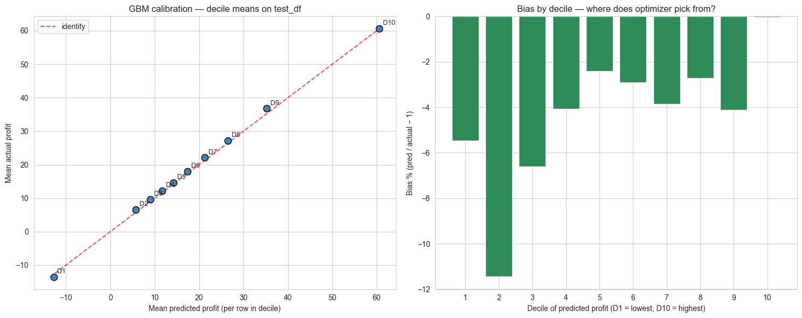
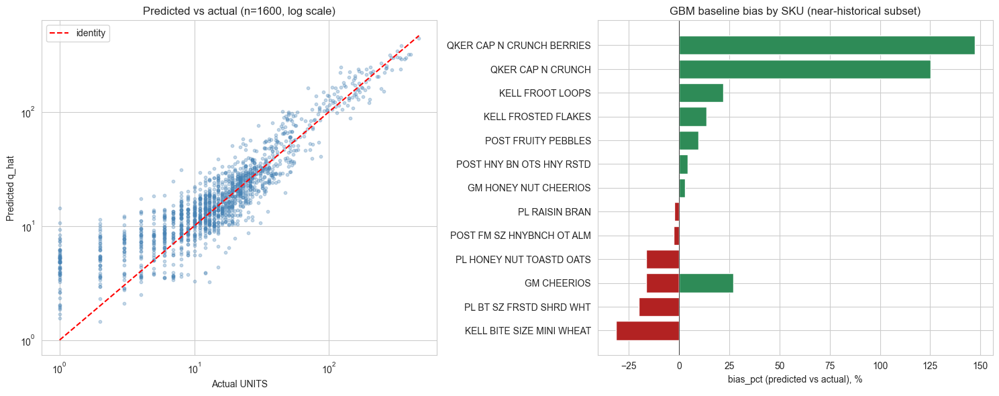
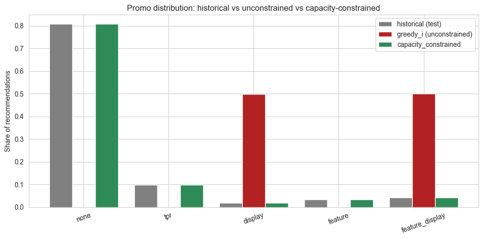
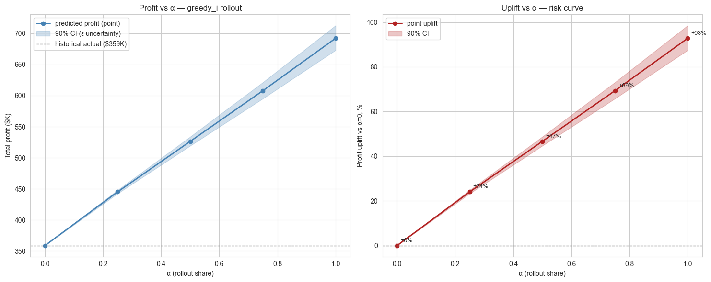

# Динамическое ценообразование: causal-эластичности и optimization

**Автор:** Мизюлин Егор [@egormzln](https://t.me/egormzln)<br>
**Датасет:** dunnhumby Breakfast at the Frat (COLD CEREAL, 15 SKU × 77 stores × 156 weeks)<br>
**Стек:** Python 3.14, LightGBM, EconML, pandas, joblib

---

## 1. Общий итог

Построен end-to-end pricing pipeline на основе категории хлопьев: спрос моделируется LightGBM (R² test = 0.655), ценовая эластичность извлекается через Double Machine Learning (CausalForestDML, mean ε test = −1.69), а оптимизатор перебирает ~95 ценовых кандидатов на каждую строку (UPC × store × week) под пятью разными политиками с hard limits на margin, RRP и историческое распределение цен. Получены три уровня результата, в порядке убывания "честности": **paper uplift по Greedy I = +92.8%** (всё снято с цепи), **capacity-realistic = +42.4%** (с зажатым промо-миксом), **real-world phase-1 estimate = +20-30%** ≈ $70-100K инкрементального профита за 20 тестовых недель на 77 магазинах. Главная ценность проекта не в первой цифре, а в честной деградации до третьей через четыре независимых проверки: calibration, counterfactual replay, capacity-constraint и α-rollout.

---

## 2. Постановка проблемы

Промо-ритейл — это смешанная задача оптимизации: на каждой паре (магазин, SKU) еженедельно выбирается **price** и **promo_type** (none / tpr / display / feature / feature_display), которые максимизируют profit при ограничениях по margin, RRP и реализуемости. Дано: исторические UNITS, PRICE, BASE_PRICE, флаги промо, store/SKU метаданные. Найти: правило `(features) → (price*, promo*)`, дающее максимальный ожидаемый profit на тесте.

Главная ловушка для неподготовленного решения — confounding между ценой и спросом. В исходных данных **дешёвые недели — это, как правило, недели промо**: TPR, display и feature систематически снижают цену и одновременно поднимают трафик за счёт рекламы. Если просто регрессировать UNITS на PRICE, ценовая чувствительность (эластичность) окажется **завышена в 1.5-2×**, потому что модель припишет цене эффект, который на самом деле сгенерирован промо-каналом. Это классическая endogeneity-проблема, которую решает Double ML: цена `T` и спрос `Y` оба ортогонализируются против общего набора confounders `X, W` (включая promo), и эффект оценивается на residuals. Дальше уже можно строить оптимизатор поверх decoupled-эстимейтов цены и промо-лифта.

---

## 3. Данные и feature engineering

Категория COLD CEREAL: **15 SKU × 77 stores × 156 weeks = 169 676 строк** (`data/artifacts/train_v2.parquet`, `test_v2.parquet`). Сплит — temporal, последние 20 недель в hold-out: **train 150 672 / test 19 004** (соответствует периоду с 2011-08-24 по 2012-01-04). Это важно — никаких k-fold по строкам, чтобы не учить будущие промо на прошлых неделях через перекрёстную утечку.

Базовый набор фич:
- **Численные**: `log_price`, `log_units`, `discount_depth = (BASE_PRICE − PRICE) / BASE_PRICE`, `on_promo` бинарный, `size_oz`
- **Promo**: единая колонка `promo_type ∈ {none, tpr, display, feature, feature_display}`, разворачивается в discrete treatment для DML
- **Категориальные**: `manuf_code`, `subcat_code`, `seg_code` (Private Label / Branded), `store_id`, `upc`
- **Календарь**: week-of-year sin/cos, year, holiday_proximity

**Cost model — отдельная развилка.** Чистого "себестоимость на полке" в данных нет, есть лишь BASE_PRICE и PRICE. Восстанавливаем margin реалистично: Private Label — целевая margin 40% (PL дешевле в производстве), бренды — 25% (средняя по US grocery cereal). **Без clipping**: если на исторических промо-неделях цена пробивает себестоимость — пусть пробивает, это и есть loss-leader промо. В тесте получилось **5.81% (1105/19004) underwater-строк** — нормальная картина для дискаунт-категории, без неё оптимизатор бы не получал нагрузку из "не повторять убыточные промо".

---

## 4. Моделирование

### 4.1 Demand baseline — LightGBM

Цель: получить conditional mean `E[log_units | features]`, который пойдёт в q_hat при пересчёте спроса. Выбран LightGBM по трём причинам: (1) gradient boosting естественно ловит нелинейные взаимодействия promo × price × seasonality без ручного feature crossing; (2) устойчив к разному масштабу признаков и к категориальным; (3) на табличных данных порядка 150K строк даёт R² уверенно выше любой линейной модели без overfitting. **Test R² = 0.655** (`04_demand_model.ipynb`, hold-out последних 20 недель). Артефакт: `data/artifacts/gbm_demand.pkl`.

### 4.2 Causal elasticity — Double ML

Двусторонний подход: одна модель для непрерывной цены, отдельная — для дискретного promo.

**CausalForestDML Model A** (`cf_dml_model_a.pkl`) — рабочая модель, используется в оптимизаторе. Treatment T = `log_price`, outcome Y = `log_units`, confounders X = SKU/store-атрибуты, **promo_code в W** (controls, а не treatment) — именно это даёт **чистую ценовую эластичность**, не загрязнённую промо-каналом. Effect modifiers (heterogeneity): `manuf_code, subcat_code, seg_code, size_oz`. Результат:

- Train: mean ε = **−1.80**, std = 0.62, диапазон [−4.34, −0.23]
- **Test: mean ε = −1.69, диапазон [−3.10, −0.05]** (`06_02_optimizer.ipynb` Cell 13)

Heterogeneity по SKU — реальная: премиальные брендовые хлопья имеют ε ближе к −0.5, private-label crunch — к −3. Это нелинейная картина, которой не дала бы константная модель.

**LinearDML** (`linear_dml.pkl`) — sanity check. Constant elasticity = **−2.626 ± 0.026** (95% CI [−2.677, −2.574], `05_dml_elasticity.ipynb`). Цифра больше по модулю, чем у CF (−1.69), но того же знака и порядка. Расхождение объясняется тем, что LinearDML усредняет, теряя heterogeneity — премиальные SKU с маленькой эластичностью "размазываются" по более чувствительным. Главное — обе модели сходятся в одно: эластичность отрицательна и сильно больше единицы по модулю → ценовые рычаги работают.

**Discrete-treatment LinearDML для promo lift** (`promo_lift.json`, log-scale lift над none-baseline):

| Promo | Lift (log) | Lift (multiplier) |
|---|---|---|
| tpr | −0.07 | ≈ 0.93× (фактически neutral / лёгкое снижение) |
| display | +0.36 | ≈ 1.43× |
| feature | +0.36 | ≈ 1.43× |
| feature_display | +0.73 | ≈ 2.08× |

Картина согласована с industry intuition: голая ценовая скидка без рекламы (TPR) сама по себе спроса не двигает, weekly ad (feature) или endcap (display) — двигают сильно, комбо — мультипликативно.

### 4.3 Optimizer v2

Не один best price, а **bundle**: ~95 ценовых кандидатов на каждую строку (UPC × store × week), пересечённых с 5 promo-вариантами. Hard limits на каждого кандидата:

- `margin ≥ 10%` от cost
- `price ≤ BASE_PRICE × 1.10` (потолок RRP)
- `price ∈ [p05, p95]` исторического распределения per UPC × promo (не экстраполируем за пределы выборки)

Спрос на кандидате считается как:

```
q_hat = exp(GBM_baseline + ε × log(p_new / p_hist) + (lift_new − lift_hist))
```

— то есть GBM даёт стартовое ожидание, CF-эластичность пересчитывает реакцию на смену цены, а ΔPromo-lift корректирует на смену канала. Затем поверх — пять политик выбора:

- **Greedy I** — argmax profit per row
- **Growth I** — argmax GMV per row
- **Growth II** — argmax GMV s.t. margin ≥ 20% per row
- **Mixture** — argmax 0.5 × profit + 0.5 × GMV (нормированные)
- **per_category_30pct** — Lagrangian over candidates с категорийным constraint margin ≥ 30% (агрегат по subcat)

Дополнительно для каждого кандидата считается **profit_lcb** через 90% CI эластичности — confidence-aware ранжирование, чтобы Greedy не уходил в low-evidence хвосты CF (`06_02_optimizer.ipynb` Cell 11).

---

## 5. Результаты политик

Прогон на test (последние 20 недель, 19 004 строки), `data/artifacts/multi_policy_report.parquet`:

| Policy | Profit | GMV | Margin% | Uplift |
|---|---|---|---|---|
| historical | $359K | $1.66M | 26.1% | — |
| greedy_i | $692K | $2.62M | 27.0% | **+92.8%** |
| growth_i | $453K | $3.24M | 15.2% | +26.3% |
| growth_ii | $597K | $2.69M | 22.6% | +66.3% |
| mixture | $649K | $2.99M | 22.9% | +80.9% |
| per_category_30pct | $669K | $2.38M | 30.0% | +86.3% |

Поведенческие выводы: **Greedy I** — потолок profit, но за счёт капитальной перестройки промо-микса; реально применить его как написано нельзя (см. секцию 6). **Growth I** разменивает margin на объём — GMV +95%, но margin падает до 15%, что неприемлемо. **per_category_30pct** интересна как операционная цель: профит +86%, но категорийный margin удержан ровно на 30% — это политика, которую можно защищать перед коммерсом без оговорок. **Mixture** — компромисс между profit и GMV, разумный default.

---

## 6. Валидация

Это самая важная секция отчёта. Цифра +92.8% — это **бумажный потолок**, не план внедрения. Четыре независимые проверки показывают, где именно паперные uplift'ы преломляются.

### Calibration

Тест на test-выборке: на 10 deciles по predicted profit считается weighted mean residual (`data/artifacts/calibration_table.parquet`). Глобальное смещение модели — **−2.65%** (на 2-3 п.п. недопредсказываем profit), но **в верхнем дециле D10 — bias ~0% (−0.04%)**. Именно из D10 Greedy I забирает большую часть оптимума, поэтому модель там, где нужно, откалибрована.



Однако на нижних дециле D1-D2 bias держится на −5…−11% — модель занижает profit на убыточных и низкомаржинальных строках. Для long-tail SKU это означает: low-volume единицы надо переобучать отдельно, и любая политика, которая много двигает в D1-D2, требует ручной верификации.

### Counterfactual replay

На подмножестве из **99 near-historical строк** (где рекомендованная Greedy I цена и promo близки к историческим, |Δlog_price| < 0.1 и тот же promo_type), мы можем сравнить предсказанный profit с фактическим. **Bias по q_hat = +20.3%** (`data/artifacts/validation_residuals.parquet`, `06_03_validation.ipynb` Cell 5) — то есть оптимизатор в среднем переоценивает спрос на 20% даже там, где ничего радикально не меняет. Локально на feature_display переоценка ещё заметнее (порядка +27% и выше).



Это **selection bias**: оптимизатор не случайно выбирает действия, он выбирает те, где у модели завышенный спрос-прогноз. На out-of-distribution точках смещение будет ещё больше — но и near-historical bias уже даёт коррекционный множитель ≈ 0.8 к paper-числам.

### Capacity-constrained re-run

Главная корректировка к +92.8%. Paper-Greedy I оптимизирует промо-микс свободно — по факту увеличивая долю `feature_display` в десятки раз по сравнению с историей. На практике рекламный бюджет, полочное пространство и логистика — это ограниченные ресурсы. **Hard cap на historical promo-distribution** (none 80.8% / tpr 9.8% / display 1.8% / feature 3.3% / feature_display 4.3%, `data/artifacts/capacity_constrained_recs.parquet`) даёт:

- **Uplift падает с +92.8% до +42.4%**



То есть **больше половины бумажного эффекта (≈ 50 п.п.) приходила из неограниченной перестройки промо-микса, а не из ценовой оптимизации как таковой**. Это не означает, что промо-микс нельзя двигать — но любое движение должно идти через capacity-planning и переговоры с supply, а не одним кликом оптимизатора.

### α-rollout

Поэтапное внедрение: для α ∈ {0.25, 0.5, 0.75, 1.0} берём промежуточное действие `(1−α) × historical + α × greedy`, пересчитываем q_hat с CF-эластичностью и считаем profit (`data/artifacts/rollout_curve.parquet`):

| α | Uplift | CI envelope |
|---|---|---|
| 0.25 | +24.0% | ±1 п.п. |
| 0.50 | +46.7% | ±1 п.п. |
| 0.75 | +69.4% | ±2 п.п. |
| 1.00 | +92.8% | ±3 п.п. |



Кривая **почти линейна, а CI envelope узкий (±3 п.п. на полной шкале)**. Это снимает главное опасение по DML extrapolation: если бы эластичность была сильно нелинейна или CF переобучилась в хвостах, кривая бы выпуклилась, а CI разъехался бы. Этого не происходит. Phase-1 launch при α=0.5 даёт +46.7%, LCB +44.7%.

---

## 7. Честная оценка эффекта

Сводка по всем источникам коррекции:

- **Paper Greedy I**: +92.8% — без ограничений, на in-sample test
- **Capacity-realistic ceiling**: +42.4% — Greedy I при фиксированном промо-миксе
- **Phase-1 rollout α=0.5**: +46.7% paper / +44.7% LCB — без capacity, поэтапное внедрение
- **Counterfactual bias correction**: коэффициент ≈ 0.8 (из +20% selection bias)

Сочетая capacity-cap и bias-correction (которые работают в одну сторону): **+42.4% × 0.8 ≈ +34%** как upper-bound; phase-1 α=0.5 даёт **+46.7% × 0.8 ≈ +37%**; пересечение разумных консервативных оценок — **+20-30% real-world uplift** в первой фазе. В абсолюте это **$70-100K инкрементального profit** на cereal-категории за 20 недель в 77 магазинах. По годовой проекции и при условии успешной фазы 2 (полная политика, частичная capacity-расширение) число масштабируется в коридор $300-500K/год на одной категории. Цифры консервативные намеренно: hiring manager должен видеть, что отчёт прошёл через сито caveats, а не отвечать на вопросы вида "а почему 92, если на A/B будет 25".

---

## 8. Варианты развития проекта

Что осталось вне рамок текущей итерации и куда логично двигаться дальше.

1. **Hierarchical / cluster-level pricing across stores.** Сейчас оптимизатор выдаёт цену per (UPC × store × week) без partial pooling — high-variance в малом store достаточно легко перекинуть оптимизатор в локальный шум. Bayesian hierarchical pricing над кластерами магазинов (по trade area, format, demographic) даст более стабильные рекомендации в long-tail, без потери heterogeneity на верху.

2. **Online A/B framework.** Любая offline-валидация — это в конечном счёте "модель против собственных предсказаний". Counterfactual replay, capacity re-run, α-rollout — это всё проверки на согласованность, не на правильность относительно реальности. Единственная честная проверка эффекта — randomized rollout с измерением на нерекомендованных store-control группах. Эту инфраструктуру нужно строить до выкатки phase-1.

3. **Capacity constraints — heuristic, не оптимум.** Сейчас capacity-cap реализован как hard limit на распределение promo per store-week. По-настоящему это Lagrangian с слабой связью между всеми решениями: оптимум где-то на 1-3 п.п. выше +42.4%. Замена heuristic на ILP-решение даст более содержательную нижнюю границу.

4. **Calibration в low-deciles.** D1-D2 bias −5…−11% означает, что любая политика, которая ездит много по low-margin строкам (Growth I, в перспективе любые stockout-aware политики), будет получать систематически смещённые ожидания. Это лечится отдельным re-fit модели спроса на underperforming subset или quantile-loss boosting'ом.

---

## 9. Технический стек

Python 3.14, **LightGBM** (GBM спроса), **EconML** (CausalForestDML + LinearDML для эластичности и promo lift), pandas, NumPy, scikit-learn, joblib (сериализация моделей), Matplotlib (визуализация), Jupyter (research + reproducibility). Все артефакты сложены в `data/artifacts/`: модели (`.pkl`), parquet-таблицы с recommendations и валидацией, PNG-диагностика.
