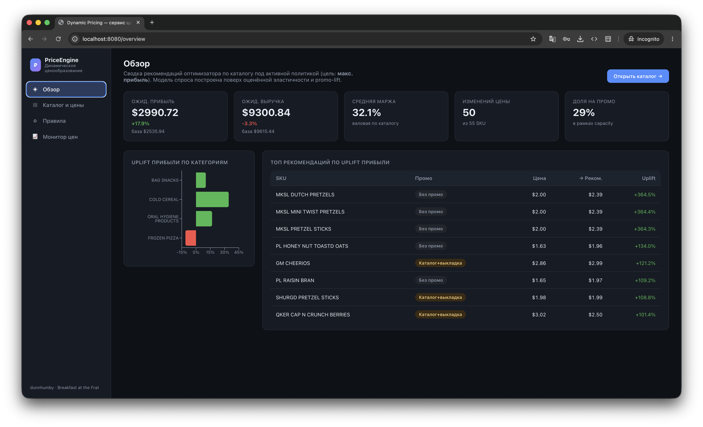
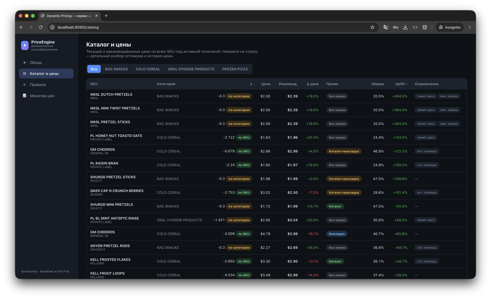
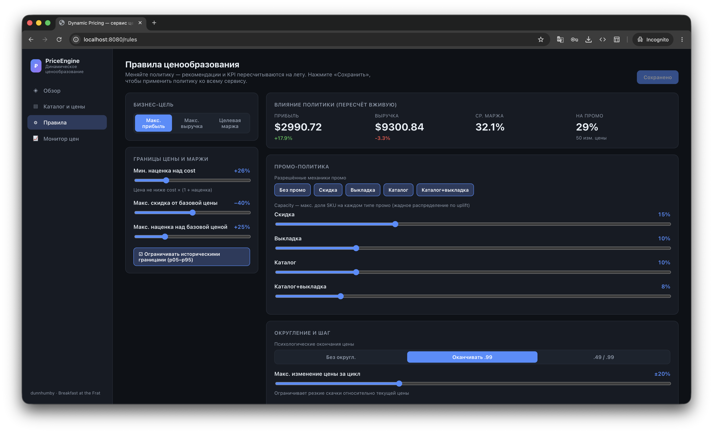
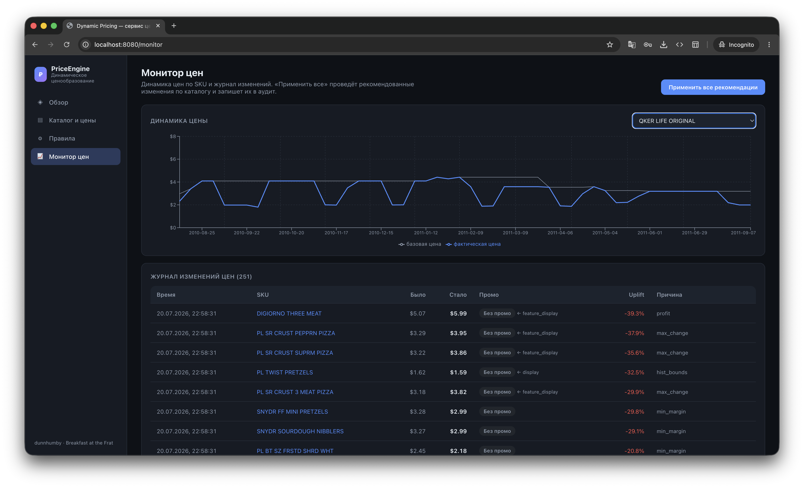

# Динамическое ценообразование

Сервис, который по данным ритейла рекомендует оптимальную **цену × промо** для каждого SKU: от сырых транзакций и оценки эластичности спроса — до интерактивного веб-интерфейса с правилами, рекомендациями и аудитом изменений цен.

> **Датасет:** dunnhumby «Breakfast at the Frat» · 55 SKU · 4 категории (Cold Cereal, Bag Snacks, Frozen Pizza, Oral Hygiene)

---

## Что это

Проект состоит из двух частей:

1. **DS-пайплайн** (`notebooks/`) — оценивает по историческим данным ценовую эластичность спроса и эффект промо-механик, строит модель спроса и оптимизатор цены, валидирует результат.
2. **Веб-сервис** (`service/`) — переносит сохранённые коэффициенты модели в онлайн-оптимизатор с FastAPI backend и React frontend. Меняете политику ценообразования — рекомендации и KPI по всему каталогу пересчитываются вживую.

---

## Интерфейс

### Обзор — сводка по каталогу
KPI под активной политикой (ожид. прибыль/выручка, средняя маржа, число изменений цены, доля промо), uplift прибыли по категориям и топ рекомендаций.



### Каталог и цены
Все SKU с эластичностью ε, текущей и рекомендованной ценой, промо-механикой, маржой, uplift'ом и списком «биндинг-правил» (какое ограничение упёрлось в цену).



### Правила ценообразования
Бизнес-цель (макс. прибыль / выручка / целевая маржа), границы цены и маржи, промо-политика с capacity по типам промо, психологическое округление и максимальный шаг цены за цикл. Всё пересчитывается на лету.



### Монитор цен
Динамика цены по SKU (базовая vs фактическая) и журнал изменений с причиной каждого решения (`min_margin`, `max_change`, `hist_bounds` …).



---

## Как это работает

**Модель спроса** (serving поверх сохранённых коэффициентов):

```
units(p, promo) = base_units · (p / base_price)^ε · exp(promo_lift[promo])
profit          = (p − cost) · units
```

Ключевая идея пайплайна — **отделить чистую ценовую эластичность `ε` от эффекта промо**. В сырой регрессии глубокая скидка почти всегда идёт в пакете с рекламой (feature) и выкладкой (display), из-за чего наивная оценка эластичности завышена (−4 и ниже). Поэтому промо-lift оценивается отдельно, а `ε` — на «чистом» ценовом сигнале.

**Оптимизатор** для каждого SKU перебирает сетку цен по каждому разрешённому промо, максимизирует бизнес-цель и уважает правила политики: минимальную маржу, макс. скидку/наценку, исторические границы (p05–p95), макс. изменение за цикл и .99-округление. Промо-слоты распределяются жадно по uplift'у в рамках заданного capacity.

Пайплайн ноутбуков:

```
01_eda → 02_features → 03_eda_plots → 04_demand_model
      → 05_dml_elasticity → 06_01/02_optimizer → 06_03_validation
```

Валидация (`06_03`) проверяет, что uplift не артефакт смещённой модели: counterfactual replay, calibration по децилям и прогон с жёсткими capacity-ограничениями.

---

## Архитектура

| Компонент | Технологии | Роль |
|---|---|---|
| **backend** | FastAPI · Pydantic · SQLite | API `/api/*`, оптимизатор, хранение политики и аудит изменений цен |
| **frontend** | React · Vite · Recharts | 4 экрана UI, живой пересчёт при смене правил |
| **caталог** | `catalog.json` | компактный снапшот SKU + коэффициентов, который backend грузит в память |

Backend читает предрассчитанный `catalog.json` (собирается из CSV и артефактов модели скриптом `build_catalog.py`), поэтому онлайн-часть не зависит от тяжёлых DS-библиотек.

---

## Запуск

Нужен Docker. Из папки `service/`:

```bash
cd service
docker compose up --build
```

Открыть **http://localhost:8080**.

Пересобрать каталог из данных и коэффициентов модели (опционально):

```bash
cd service/backend
python scripts/build_catalog.py
```

---

## Структура репозитория

```
dynamic-pricing/
├── notebooks/          # DS-пайплайн: EDA, фичи, модель спроса, эластичность, оптимизатор, валидация
├── data/
│   ├── raw/ csv/       # исходные данные dunnhumby
│   ├── features/       # инженерные фичи
│   └── artifacts/      # оценённые ε, promo_lift, графики валидации
├── assets/             # скриншоты интерфейса
└── service/
    ├── backend/        # FastAPI: оптимизатор, правила, API, SQLite
    ├── frontend/       # React + Vite UI
    └── docker-compose.yml
```
